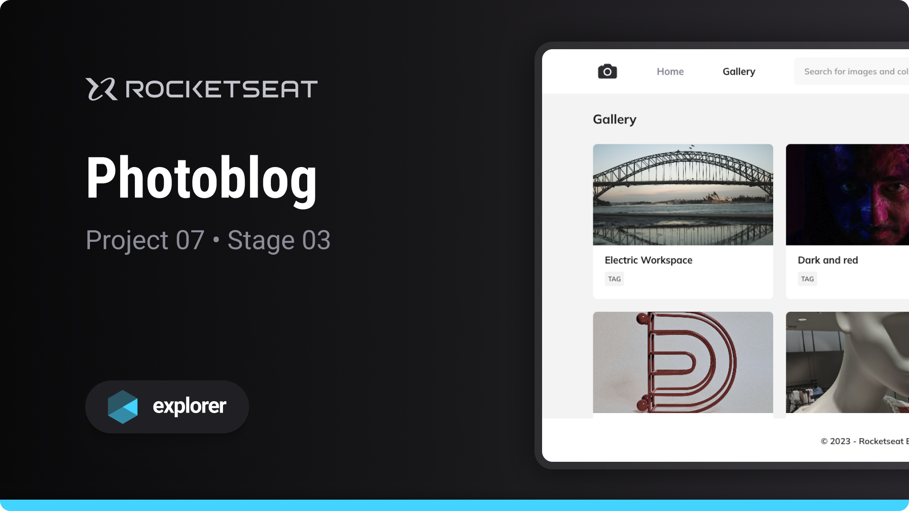

# Photoblog

Project developed on Rocketseat's Explorer course

**Photoblog is a blog designed to learn basic web development concepts**

## 🔗 Project Links

- 🚀 [**Deploy**](https://emanueltavecia.github.io/photoblog)
- 🎨 [**Figma**](https://www.figma.com/community/file/1256354844988182987/fotoblog-projeto-explorer)

## 📋 Project information

- Rocketseat Explorer
- Stage 03
- Project 07

## 🧠 Concepts learned

The development of this project aims to learn the following concepts:

- Responsiveness
- CSS styling
  - grid, variables, animations, transitions

## 💻 Technologies

## 📄 License

This project is licensed under the MIT License - see the [LICENSE](./LICENSE) file for more details.
